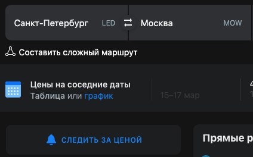
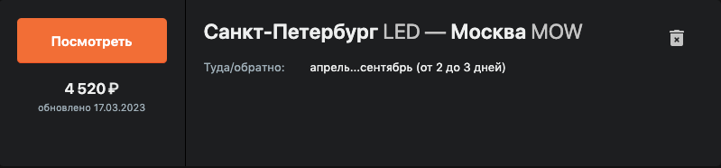

# Aviasales subscriptions parser

#### The parser works with e-mails from Aviasales.ru

### Create subscriptions on Aviasales.ru

#### Your city -> Destination city
#### Parser use only destination city!

#### Your subscriptions:

   [Check your subscriptions](https://www.aviasales.ru/my/subscriptions)

### Install
#### 1. get Google application password 
[get password](https://myaccount.google.com/apppasswords)

#### 2. get Telegram bot token 
[get bot token](https://t.me/BotFather)
    
#### 3. get your Telegram id
[get telegram id](https://t.me/getmyid_bot)

#### 4. create .env file in project folder
    example:
     - PASSWORD=abc
     - USERNAME=yourgoogle@gmail.com
     - TELEGRAM_BOT_TOKEN=token
     - CHAT_ID=telegram_id
    
#### 5. make run.sh executable 
    chmod u+x run.sh

#### 6. edit table.json
    <destination_city>: <max_price>

### Run
    Run ./run.sh